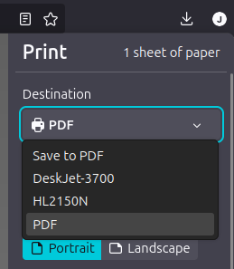
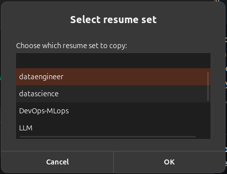
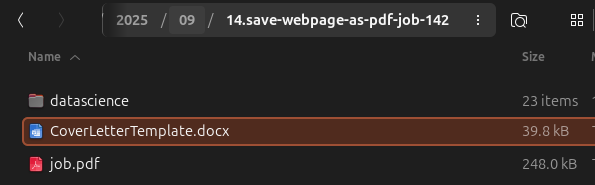

# Job Hunt Tool

> Automate saving job postings and bundling resumes/cover letters into organized folders — so you can focus on applying, not file management.

---

## ✨ What is this?
While job hunting, I noticed I was doing a lot of **manual clicking, pasting, renaming, and moving files** every time I applied somewhere. Saving job postings as PDFs, renaming them, creating folders, copying the right resume + cover letter… it added up.

So I built **Job Hunt Tool** — an automation that listens for PDFs printed from Firefox/Brave/Chromium, renames and files them into a structured directory, and drops in your chosen resume set + cover letter.

---

## 🛠️ Requirements

- **OS**: Ubuntu 24.04 LTS (GNOME desktop, default)
- **Browsers**: Firefox (snap), Brave, or Chromium (must be able to print via CUPS‑PDF)
- **System**: `systemd` (user services)
- **Shell**: Bash
- **Dependencies** (installer handles):
  - `printer-driver-cups-pdf`, `inotify-tools`, `zenity`, `rsync`, `gnome-terminal`, `libnotify-bin`
- Optional: `git`

---

## ⚙️ Setup
```bash
git clone https://github.com/johmicrot/job-hunt-tool.git
cd job-hunt-tool
bash install.sh
```

Create your `.env` (required):
```bash
cp .env.example .env
nano .env
```
- `DEST_ROOT` – where organized jobs go (`~/jobs` by default)
- `COVER_LETTER` – path to your cover letter
- `RESUME_DIR` – parent directory with subfolders for resume variants
- `WATCH_DIR` – CUPS‑PDF output directory (e.g., `~/PDF`)

---

## 🧭 Quick walkthrough (with screenshots)

### 1) Print the page via CUPS‑PDF
In the browser print dialog, choose the **PDF** printer (the CUPS‑PDF virtual printer). Then click **Print**.



### 2) Pick a resume set to copy
After printing, a dialog pops up so you can select which **resume set** to include (folders under `RESUME_DIR`).



### 3) Resulting output
The tool files the PDF and copies your **cover letter** plus selected **resume set** into a dated folder:

```
~/jobs/YYYY/MM/DD.urlname/
  ├─ job.pdf
  ├─ CoverLetterTemplate.docx
  └─ <chosen-resume-set>/
```


